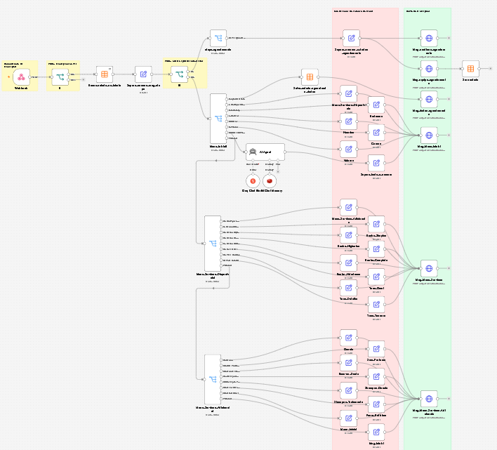
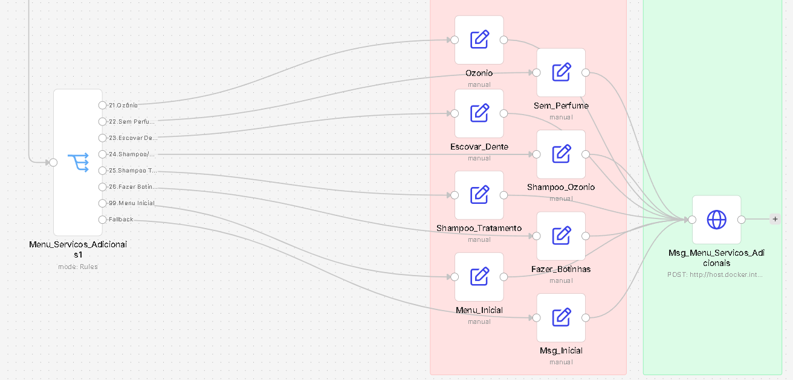
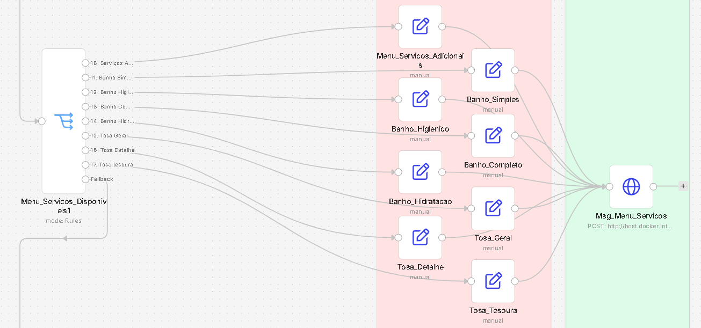
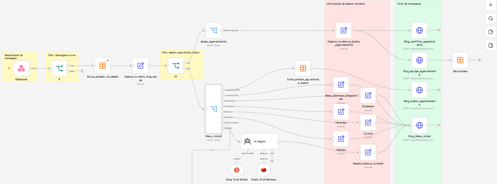

[README.md](https://github.com/user-attachments/files/29168884/README.md)
# 🐾 Chatbot WhatsApp para PetShop — Automação com n8n

Automação completa de atendimento via WhatsApp para um petshop, construída no **n8n**, integrando **Evolution API** (WhatsApp), **IA local/cloud (Groq)** e um sistema de **controle de estado por cliente** para conversas com múltiplas etapas.

## 🎯 O problema que o projeto resolve

Um petshop recebe mensagens repetitivas no WhatsApp (horário, endereço, serviços, preços) que não precisam de inteligência artificial para serem respondidas — e perguntas pontuais que necessitavam de uma IA. O desafio era construir um fluxo que:

- Responda instantaneamente a perguntas comuns **sem gastar tokens de IA**
- Use IA **apenas** quando a pergunta foge do menu padrão
- Permita que o cliente inicie um **agendamento em várias etapas**, sem perder o contexto da conversa no meio do caminho
- Não entre em loop ao processar as próprias mensagens enviadas pelo bot

## 🧠 Decisões de arquitetura

**Estado por cliente, não por mensagem.** Cada cliente tem uma "etapa" salva em uma tabela (`estados_clientes`). Toda mensagem que chega primeiro consulta essa etapa antes de decidir o que fazer — isso evita que o bot "esqueça" que o cliente estava no meio de um agendamento e o jogue de volta pro menu inicial.

**Custo controlado.** Informações estáticas (endereço, horário, lista de serviços, preços) são respondidas com texto fixo, sem acionar IA. A IA (Groq) só é chamada quando a mensagem do cliente não se encaixa em nenhuma opção do menu.

**Filtro de eco.** Como o WhatsApp via Evolution API dispara webhook tanto para mensagens recebidas quanto enviadas, o fluxo filtra por `fromMe: false` logo na entrada — evitando que o bot processe e responda às próprias mensagens.

## 🗺️ Visão geral do fluxo

## 🔍 Detalhamento por seção

### 1. Recepção, filtro e roteamento por estado
Webhook recebe a mensagem → filtra eventos duplicados/eco → busca a etapa salva do cliente na tabela → decide se segue para o menu inicial ou retoma um fluxo em andamento (como agendamento).

### 2. Menu de serviços (nível 1)
Submenu com as opções principais de serviço — cada opção dispara uma resposta de texto fixo específica, sem IA.

### 3. Menu de serviços adicionais (nível 2)
Submenu de aprofundamento para serviços complementares (ozônio, escovação de dentes, tratamentos), mantendo a mesma lógica de resposta direta.

## 🛠️ Stack utilizada

- **n8n** — orquestração do fluxo (self-hosted via Docker)
- **Evolution API** — integração com WhatsApp
- **Groq** — modelo de IA para perguntas fora do menu padrão
- **Data Table (n8n)** — persistência do estado da conversa por cliente
- **Redis** — memória de contexto para o agente de IA

## 📌 Status

Projeto funcional, testado em ambiente local com número de WhatsApp de teste. Próximos passos incluem integração opcional com Google Calendar para confirmação automática de disponibilidade.

---

*Projeto desenvolvido como estudo de automação de atendimento via WhatsApp com n8n.*
